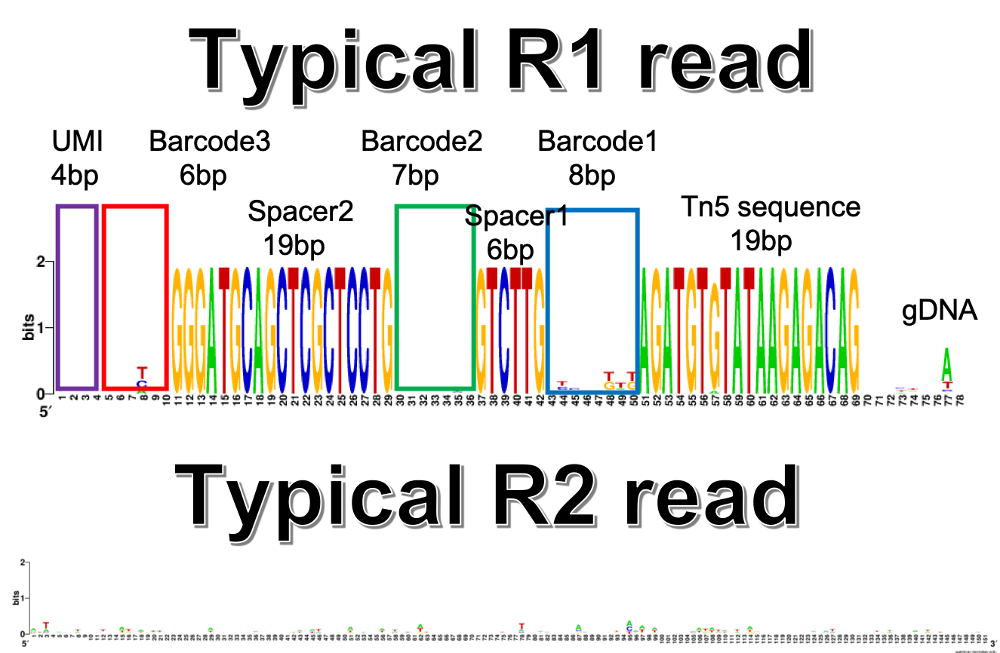

# Sci-L3-seq
Demultiplexing code for sci-L3-seq, WGS, target-seq, and co-assay

Reference code was modified and fit into HemTools pipeline (https://hemtools.readthedocs.io/en/latest/content/Gallery/run_lsf.html).

# fastq read example

# Pipeline

1. given RT_primer, assign PE reads to junk (noRT.fastq.gz) and not_junk

2. swap R2 R1 if R1 doesn't have RT_primer

3. match barcode_3, not matched reads will be discarded (noBC3.fastq.gz)

4. output barcode_3-RT PE reads to R1.ordered.fastq.gz and R2.ordered.fastq.gz

step 1 to 4 are done in step1_barcode_SSS.py

5. given barcode_1, barcode_2, barcode_3, parse files from step 4 to matched or junk, renamed read name if matched

6. cutadapt trim using Tn5 sequence 

7. bwa mapping, bam to bed

8. summerize mapping result to a table, fig1 c

# Methods

1. P5 or P7 sequencing primer are equally possible to be added at the UMI end or gRNA end. So de-multiplexing should look at both R1 and R2 reads. 

2. The reads that we can used to do demultiplexing (R1 or R2) should have this format: UMI (4nt) + SSS_barcode (6nt) + GGGATGCAGCTCGCTCCTG (20nt, RT_primer) + barcode_2 (7nt) + spacer_sequence (6nt, GTCTTG) + barcode_1 (8nt) + Tn5 (19nt, AGATGTGTATAAGAGACAG) + gRNA

3. 

## Reference

https://github.com/Yue-Jiang/sciliantifig

